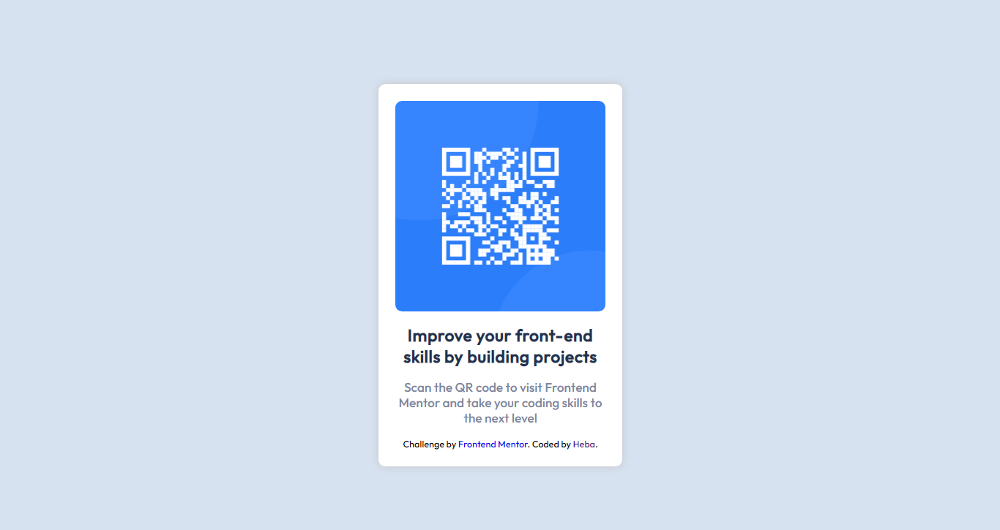

# Frontend Mentor - QR code component solution

This is a solution to the [QR code component challenge on Frontend Mentor](https://www.frontendmentor.io/challenges/qr-code-component-iux_sIO_H). Frontend Mentor challenges help you improve your coding skills by building realistic projects.

## Table of contents

- [Overview](#overview)
  - [Screenshot](#screenshot)
  - [Links](#links)
- [My process](#my-process)
  - [Built with](#built-with)
- [Author](#author)

## Overview

### Links

- Solution URL: [(https://github.com/Taktoka/qr-solution.git)](https://github.com/Taktoka/qr-solution.git)
- Live Site URL: [(https://qr-solution-nf5wal82i-taktoka.vercel.app/)]((https://qr-solution-nf5wal82i-taktoka.vercel.app/))

## My process

### Built with

- Semantic HTML5 markup
- CSS custom properties
- Flexbox

## Author

- Frontend Mentor - [@Taktoka](https://www.frontendmentor.io/profile/Heba)
